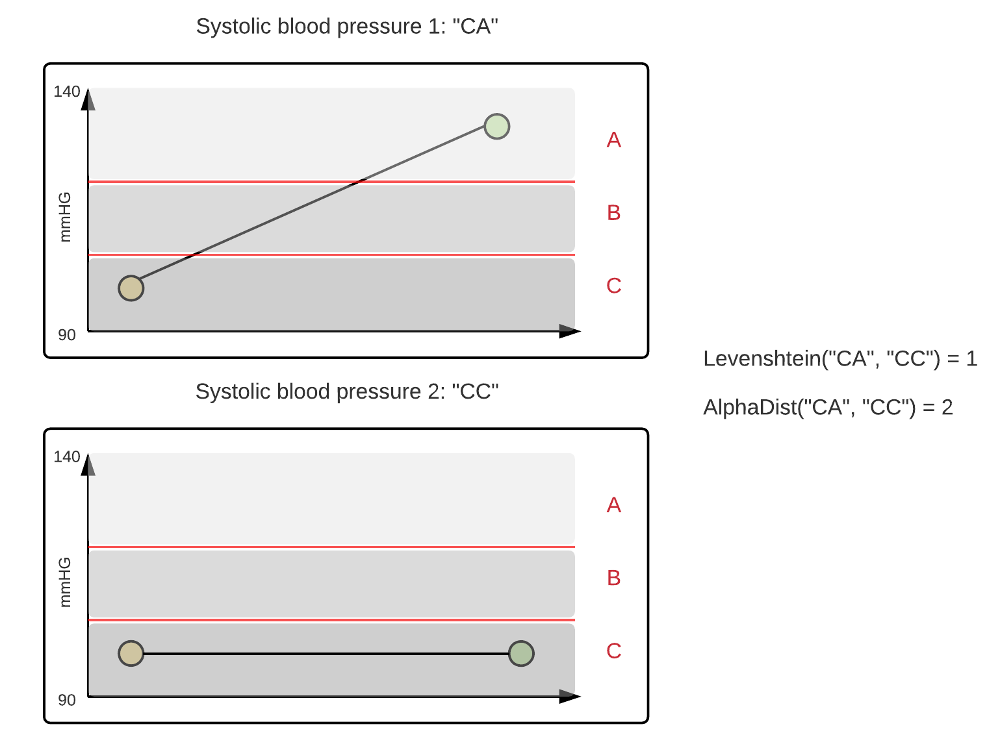

# What does alphadist do?
Alphadist is a string metric, similar to the likes of widely used metrics such as Levenshtein distance. It can be used to measure the degree of difference between two strings of the English alphabet. The output is a positive real number representing the minimum number of operations to convert one string into another. Allowed operations are:

- Substitution
- Insertion
- Deletion

Alphadist is based on Levenshtein distance, with one important difference. For substitution operations, the alphabetical difference is considered.

# Demonstrated usefulness

Comparison of Levenshtein distance and alphadist using alphabetical weighing of substitution operations. There is a significant difference within the time series, however, Levenshtein distance will never account for this as substitution operations are always weighed as 1. Using alphadist, such differences in distances will be considered. In this example, the weight of the substitution operation is two, as the alphabetical difference of the two mismatched characters is two.

# Relevance

An approach that has been used when transforming large structured datasets based on Electronic Health Records (EHR) to formats applicable to common Machine Learning (ML) algorithms is to compress multivariate features into single-valued representations [1, 2]. Additionally, these single-valued features are also turned into a numerical representations using shapelets [3]. The numerical value for each feature and subject is then derived from the distance between a representative shapelet and the actual feature value for each patient. In this operation, a distance measure is used. In the past, Levenshtein distance is the most common string metric used, although it has some clear drawbacks (e.g. lack of alphabetical weighing of operations) which alphadist attempts to address.

<h3>References</h3>

1. Zhao, J., Papapetrou, P., Asker, L., & Boström, H. (2017). Learning from heterogeneous temporal data in electronic health records. Journal of biomedical informatics, 65, 105-119.

2. Bagattini, F., Karlsson, I., Rebane, J., & Papapetrou, P. (2019). A classification framework for exploiting sparse multi-variate temporal features with application to adverse drug event detection in medical records. BMC medical informatics and decision making, 19(1), 7.

3. Ye, L., & Keogh, E. (2009, June). Time series shapelets: a new primitive for data mining. In Proceedings of the 15th ACM SIGKDD international conference on Knowledge discovery and data mining (pp. 947-956). ACM.
